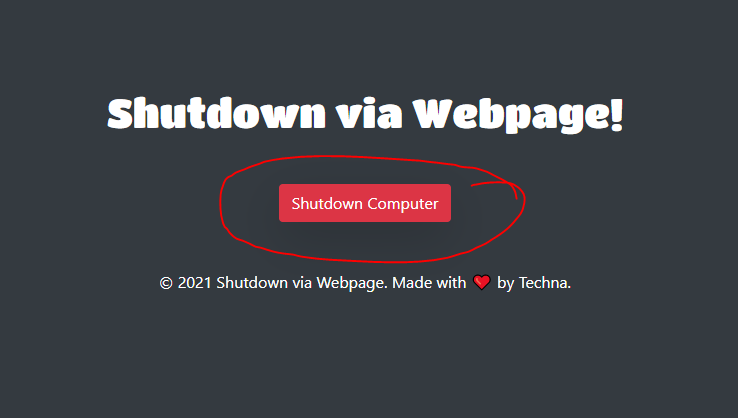

<h1 align="center">
  <a href="https://techna.pk">
    Shutdown via Webpage
  </a>
</h1>

## Available Scripts

In the project directory, you can run:

### `npm start`

Runs the app in the development mode.\
Open [http://localhost:8000](http://localhost:8000) to view it in the browser.